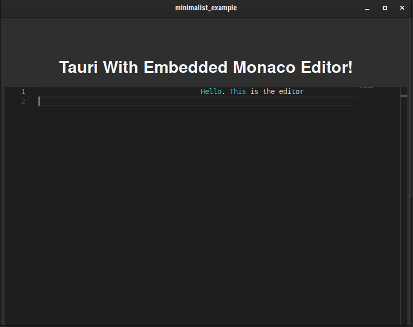

# Tauri + SvelteKit + TypeScript With Embedded Monaco Editor

This repository demonstrates how to embedded the [Monaco Editor](https://microsoft.github.io/monaco-editor/) into a minimalistic working example in a Tauri project with Rust as backend, and Sveltekit as a frontend.

## Pre-Requisites

1. [VS Code](https://code.visualstudio.com/)
2. [Dev Containers](https://marketplace.visualstudio.com/items?itemName=ms-vscode-remote.remote-containers) plugin

## Tested On

Ubuntu 22.04

## How To Use

1. Clone this repository
2. Open the root folder in `vscode`
3. Confirm "yes" when prompted to open in a container
4. Wait
5. On success, `vscode` will open the project in _"DevContainer: MinimalistTauri"_
6. Hit `Ctrl+Shift+B` to open a list of shortcuts;
7. Choose "Build Window, Debug"
8. On success, the following message will appear:
   ```bash
   Finished 2 bundles at:
        /workspaces/Minimalist_Tauri_with_MonacoEdtor/minimalist_example/src-tauri/target/release/bundle/deb/minimalist-example_0.0.0_amd64.deb
        /workspaces/Minimalist_Tauri_with_MonacoEdtor/minimalist_example/src-tauri/target/release/bundle/appimage/minimalist-example_0.0.0_amd64.AppImage
   ```
9. Open the **appimage** to open a window:

   

## Request

Please suggest improvements to this setup, e.g., a minimized docker container.
